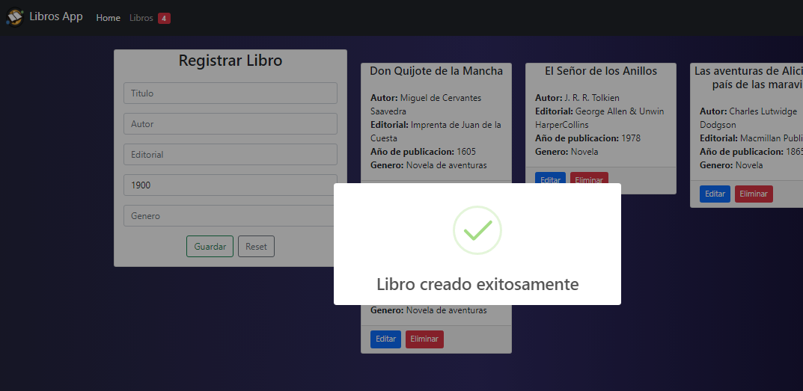
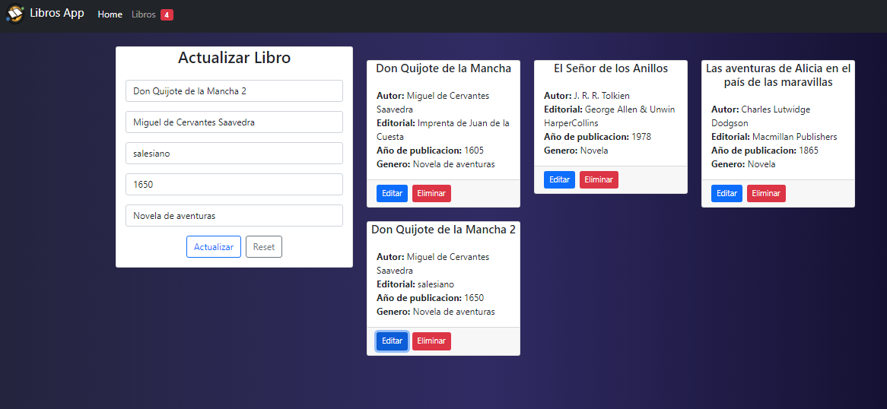
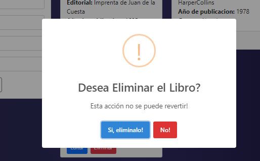
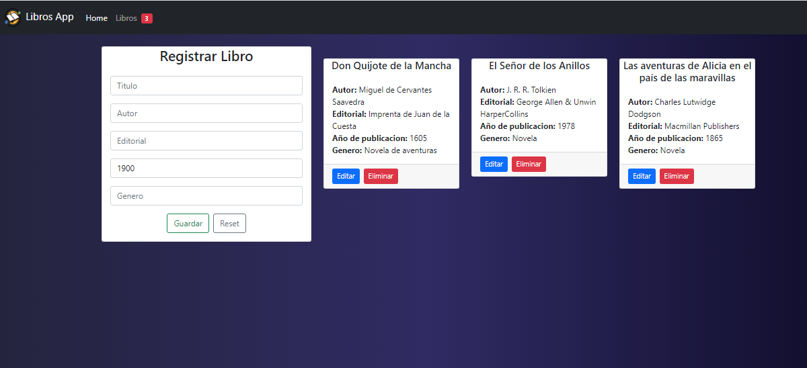

# Getting Started with Create React App Libros

This project was bootstrapped with [Create React App](https://github.com/facebook/create-react-app). 

## This site was built using

React JS  [React JS Page](https://github.com/facebook/create-react-app) \
sweetalert2 [sweetalert 2 Page](https://sweetalert2.github.io/) \
Bootstrap 5 [Bootstrap 5 Page](https://getbootstrap.com/docs/5.0/getting-started/introduction/) \
Css, Html, javascript

## Project Functionalities
Create new books
Delete Books
Edit and update data of created books
The number of books currently in the system is displayed in the navigation bar

## Data used

Qualification, Author, Editorial, Gender, Year of publication.

## Available Scripts

In the project directory, you can run:

### `npm start`

Runs the app in the development mode.\
Open [http://localhost:3000](http://localhost:3000) to view it in your browser.

The page will reload when you make changes.\
You may also see any lint errors in the console.

## Link for the application

Link [Sistema de Libros] (https://libros-react-luisp.herokuapp.com/)

## Screenshot

